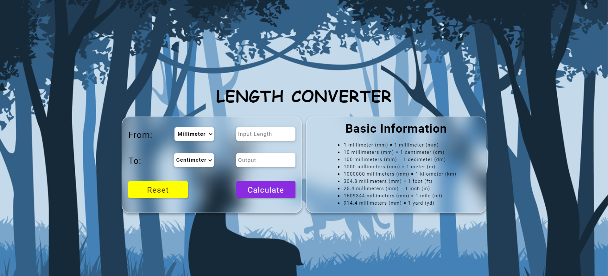

🌟 **Internpe Length Converter** 📐

Welcome to the Internpe Length Converter! 🎉 This is a handy tool that allows you to convert lengths between different units with just a few clicks. Whether you need to convert millimeters to centimeters, meters to feet, or any other length conversion, this converter has got you covered! 💪

✨ **Features:**

✅ Easy-to-use interface with a sleek and modern design
✅ Supports a wide range of length units, including millimeters, centimeters, meters, kilometers, feet, inches, miles, and yards
✅ Real-time conversion as you enter the length value
✅ Detailed information about the conversion formulas for each unit
✅ Reset button to clear the inputs and start fresh

## Screenshot 📷

🔧 **How to Use:**

1. Enter the length value you want to convert in the "From" input field.
2. Select the unit of the given length from the "From" select box.
3. Choose the desired unit you want to convert to from the "To" select box.
4. The converted value will be displayed in the "To" input box.
5. To reset the converter, click the "Reset" button.

📖 **Conversion Formulas:**

This converter uses the following conversion formulas:

- 1 millimeter (mm) = 1 millimeter (mm)
- 10 millimeters (mm) = 1 centimeter (cm)
- 100 millimeters (mm) = 1 decimeter (dm)
- 1000 millimeters (mm) = 1 meter (m)
- 1000000 millimeters (mm) = 1 kilometer (km)
- 304.8 millimeters (mm) = 1 foot (ft)
- 25.4 millimeters (mm) = 1 inch (in)
- 1609344 millimeters (mm) = 1 mile (mi)
- 914.4 millimeters (mm) = 1 yard (yd)

🔗 **Installation:**

To use the Internpe Length Converter, simply download or clone the repository and open the `index.html` file in your web browser. No additional installation or dependencies are required.

🌐 **Compatibility:**

The converter is compatible with all modern web browsers, including Chrome, Firefox, Safari, and Edge. It also supports mobile devices, so you can use it on the go! 📱
